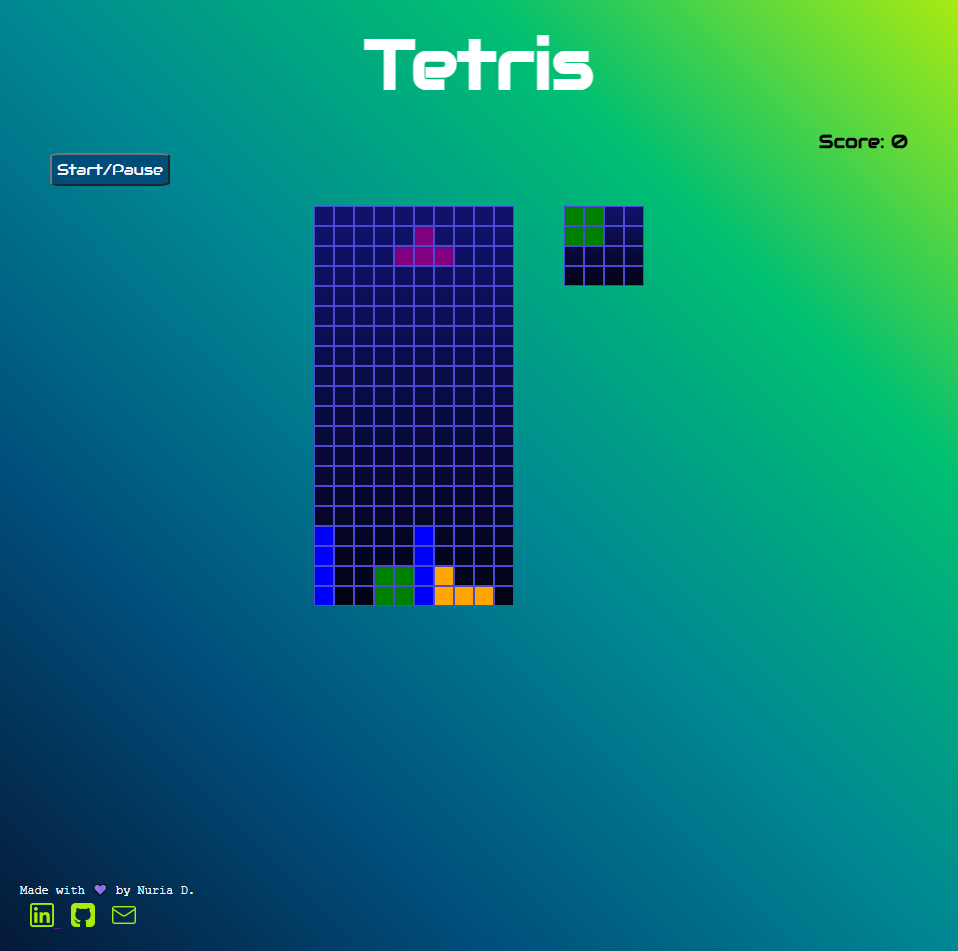

# Tetris

Proyecto realizado con JavaScript, siguiendo el tutorial de Ania Kubow
<a href= "https://www.youtube.com/watch?v=w1JJfK09ujQ&list=PLRD1Niz0lz1uR4W3ms6DygWMjXW-6hDB_&index=15&ab_channel=CodewithAniaKub%C3%B3w" target="_blank">Link</a>

## El juego:

- El juego debería detenerse si un Tetromino llena la fila más alta del tablero de juego.
- El jugador debería poder rotar cada Tetromino sobre su propio eje.
- Si se completa una línea, debe eliminarse y las piezas anteriores deben ocupar su lugar.
- Cuando se elimina una línea, se suman 10 puntos.

## Tecnologías utilizadas:

- HTML5
- CSS3
- JavaScript ES6
- Git
- Google Fonts

</img>
